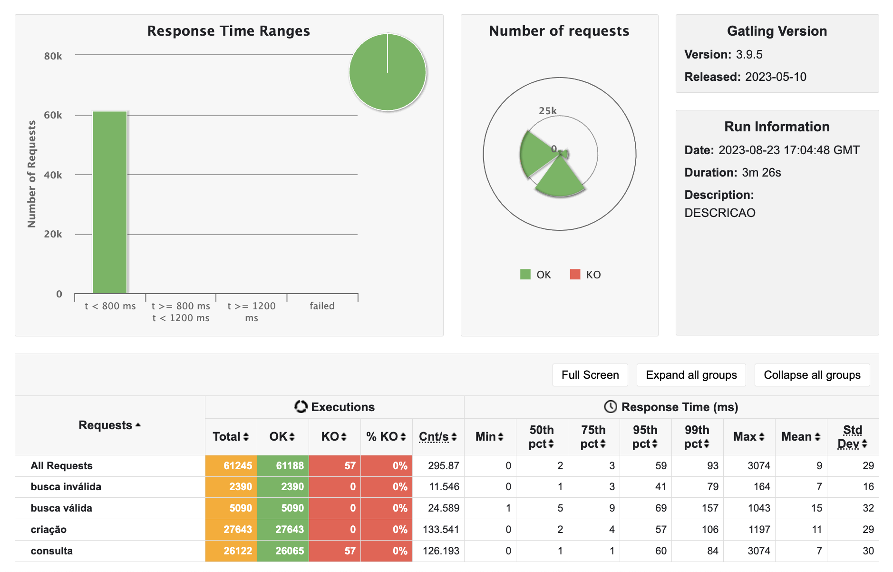
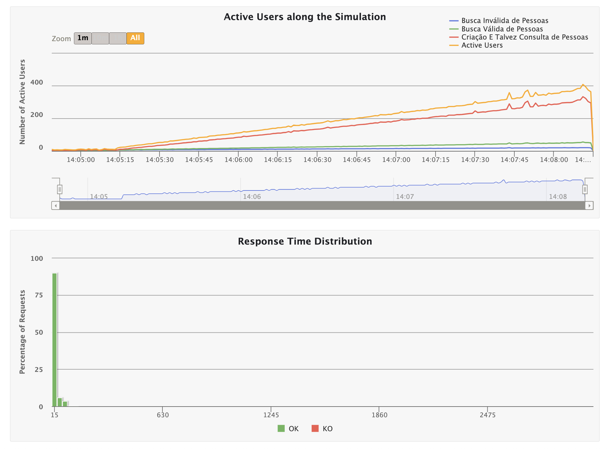
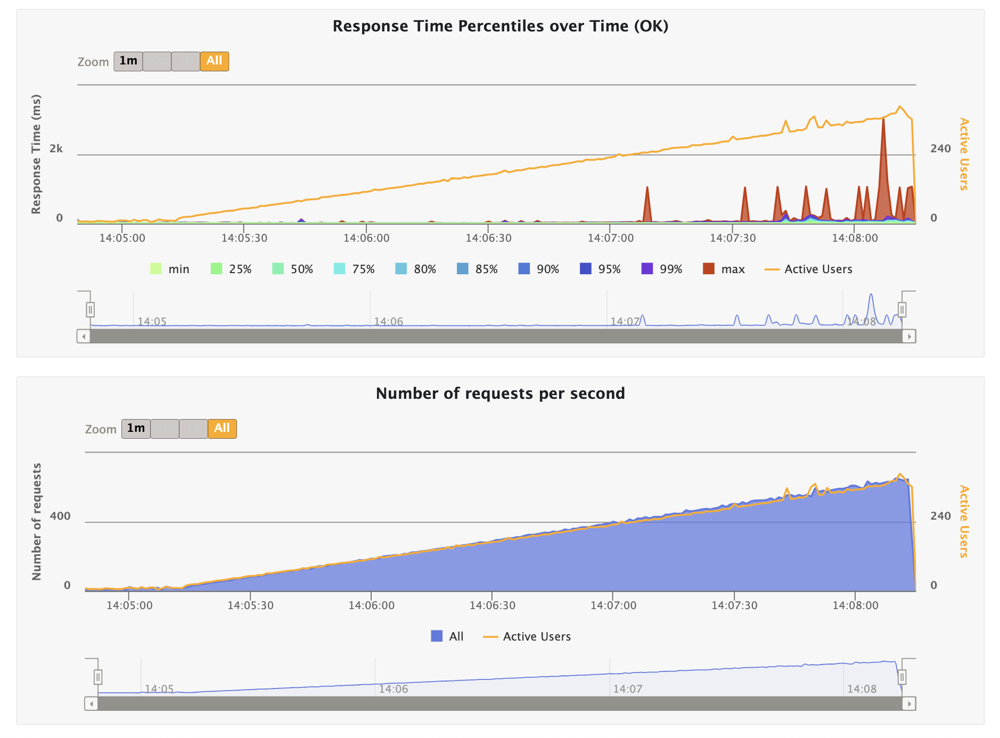
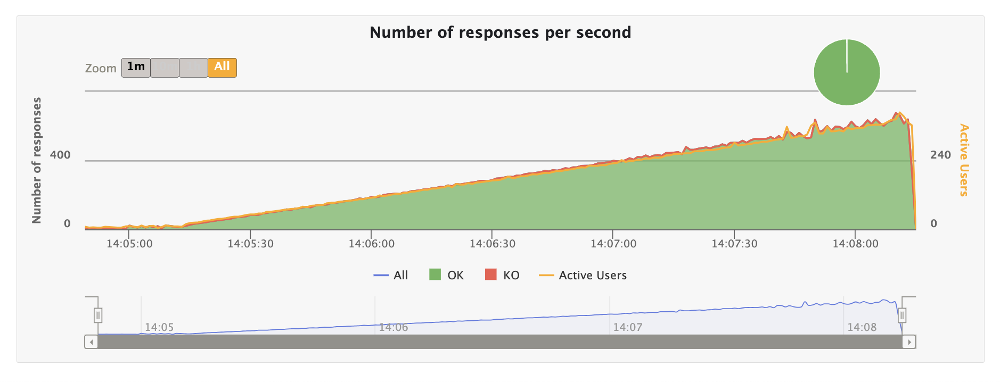

<div align="center">
<h1>wnqueiroz/rinha-de-backend-2023-q3-go</h1>

### API written in Go 1.21 + PostgreSQL built for [Rinha de Backend - Edição 2023 Q3](https://github.com/zanfranceschi/rinha-de-backend-2023-q3) 😈

<i>
Disclaimer: I didn't have time to submit the PR, this project <b>did not participate in the competition.</b>
</i>
<br/>
<br/>
<b>🚧 The approaches implemented in this project were exclusively for competition and should not be considered as production-ready. 🚧</b>

</div>

## Summary

- [Installation](#installation)
- [Up \& Running!](#up--running)
- [Stress Test](#stress-test)
  - [Results obtained](#results-obtained)

## Installation

```sh
$ go mod tidy
```

## Up & Running!

Create your `.env` file from the `.env.example` file (get environment variables from the project owner):

```sh
$ cp .env.example .env
```

So, run the command:

```sh
# development
$ go run ./cmd/httpserver

# live reload mode
$ air
```

> 💡 To use live reload mode, you need to install [air](https://github.com/cosmtrek/air/).

You can also run the project with [docker compose](https://docs.docker.com/compose/):

```sh
docker compose up -d
```

## Stress Test

You can run the run.sh script which will run [Gatling](https://gatling.io/open-source/) with the same stress test requirements as the competition.

> 💡 You must store the Gatling bundle in the path: $HOME/gatling/3.9.5/bin

```sh
sh run.sh
```

### Results obtained

Below are screenshots of the results obtained with the API. Resource restriction configuration for each application is available in [docker-compose.yaml](./docker-compose.yaml)






<!-- ## Test & Coverage

You can run the project tests with the command:

```sh
$ go test -v -coverpkg=./internal/... -coverprofile=coverage.out ./internal/...
```

This command will generate the coverage.out file that can be converted into HTML that will display the coverage percentage for each file (which has a test):

```sh
$ go tool cover -html=coverage.out -o coverage.html
```

### Updating mocks

The project is using `mockgen` (https://github.com/uber-go/mock) to build the mocks used on tests. Some files have the `go:generate` directive to generate mocks from interfaces. Always when updating the interfaces and implementing new tests, be sure to run the command below from the project folder:

```sh
$ go generate ./...
```

You must have the `mockgen` CLI installed. If not, you can do so with the command:

```sh
$ go install go.uber.org/mock/mockgen@latest
```

> 💡 The generated files must be versioned. -->
